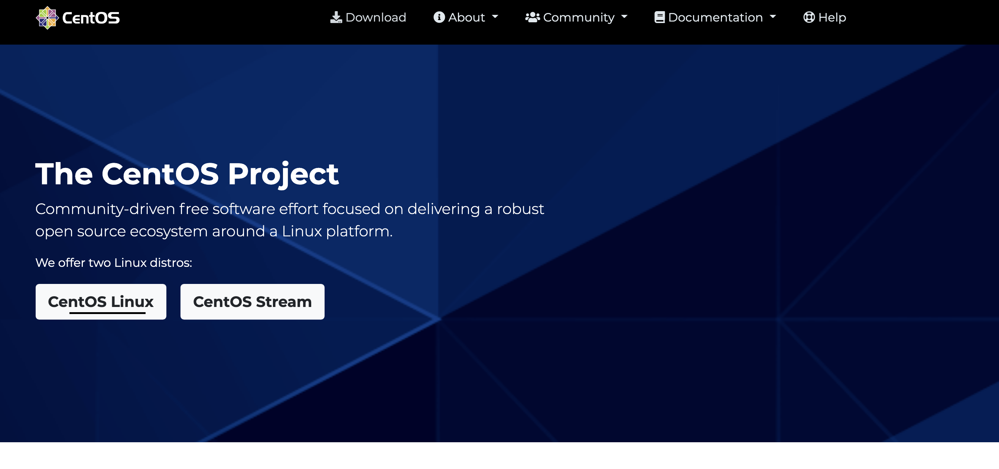
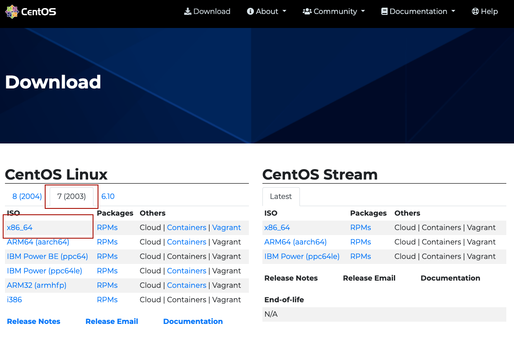
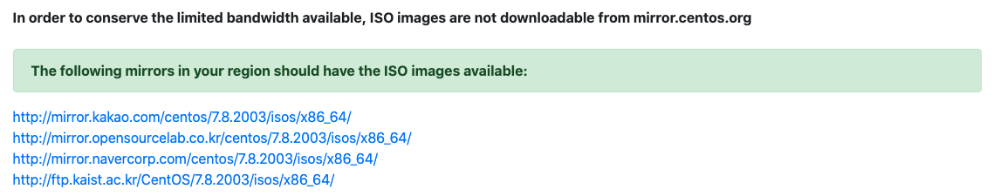

# 리눅스 설치 Hands On 

## 리눅스 패키지 다운로드 

https://www.centos.org/ -> Download -> 7(2003) -> x86_64 -> mirror 다운로드 

## kakao mirror direct iso
http://mirror.kakao.com/centos/7.8.2003/isos/x86_64/CentOS-7-x86_64-DVD-2003.iso

1. centos 홈페이지 접속

2. Download 클릭후 패키지 선택

3. 미러를 통해 패키지 다운로드


---


## 리눅스 명령어

## 온라인 테스트 환경
https://www.katacoda.com/courses/ubuntu/playground

### pwd(print working directory)
현재 위치중인 디렉토리 출력
```
$ pwd
/root
```

### mkdir (make directory)
디렉토리 생성, -p 옵션을 주면 하위 디렉토리까지 생성
절대 경로와 상대 경로의 사용 가능
```
$ mkdir /root/mydir
$ ls
mydir

$ mkdir /root/testdir/test1
mkdir: cannot create directory ‘/root/testdir/test1’: No such file or directory

$ mkdir -p /root/testdir/test1
$ ls /root/testdir
test1

$ mkdir ./testdir/test{2..10}
$ ls 
mydir  test1  test10  test2  test3  test4  test5  test6  test7  test8  test9  testdir
```

### cd(change directory)
경로 이동, 절대 경로와 상대 경로의 이동이 가능
```
$ cd /root/testdir
$ ls 
mydir  test1  test10  test2  test3  test4  test5  test6  test7  test8  test9  testdir

$ cd ..
$ pwd
/root
```

### ls(list)
디렉토리 및 파일 목록 확인
```
ls
mydir  testdir

$ ls -l
total 8
drwxr-xr-x  2 root root 4096 Oct  7 08:52 mydir
drwxr-xr-x 12 root root 4096 Oct  7 08:57 testdir

ls -a
.  ..  .bashrc  .cache  .hushlogin  mydir  .profile  .ssh  testdir  .vimrc

$ ls -al
total 36
drwx------  6 root root 4096 Oct  7 09:02 .
drwxr-xr-x 25 root root 4096 Jul 16 11:39 ..
-rw-r--r--  1 root root 3122 Jul 16 11:37 .bashrc
drwx------  2 root root 4096 Oct  7 08:43 .cache
-rw-r--r--  1 root root    0 Jul 16 11:40 .hushlogin
drwxr-xr-x  2 root root 4096 Oct  7 08:52 mydir
-rw-r--r--  1 root root  148 Aug 17  2015 .profile
drwxr-xr-x  2 root root 4096 Jul 16 11:42 .ssh
drwxr-xr-x 12 root root 4096 Oct  7 08:57 testdir
-rw-r--r--  1 root root  123 Jul 16 11:42 .vimrc
```

### cp(copy)
파일 혹은 디렉토리를 복사, 디렉토리를 복사할때는 -r 옵션을 주어야함


### mv(move)


### touch
파일이나 디렉토리의 최근 업데이트 일자를 현재 시간으로 변경, 파일이나 디렉토리가 존재하지 않으면 파일 생성
```
$ touch myfile1
$ touch myfile2
mydir  myfile1  myfile2  testdir
```
